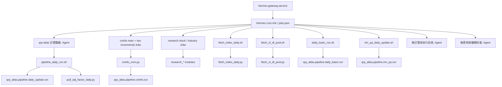
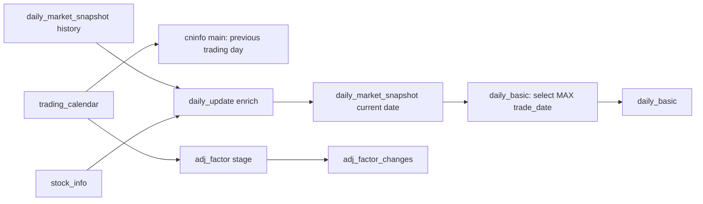

# Pipeline 现状事实与迁移边界

> 状态：基于 2026-07-29 生产环境只读调查的迁移前事实基线；范围：现有 Hermes 调度的 14 个启用 Job，本文件不是迁移执行记录
> 证据优先级：QRP 当前源码、`~/.hermes/cron/jobs.json`、Hermes 实际脚本、systemd/crontab，最后才是审计材料

## 1. 当前调度事实

- 唯一生产调度权威是用户级 `hermes-gateway.service`；其启动命令是 `python -m hermes_cli.main gateway run`，服务定义见 `~/.config/systemd/user/hermes-gateway.service:10-18`。
- Hermes 使用单一 `~/.hermes/cron/jobs.json`，不存在 `~/.hermes/cron/jobs/` 目录。`scheduler.db` 当前为 0 字节，不能作为运行历史或调度真值。
- 14 个启用 Job 都是 `cron` 计划，配置中没有每个 Job 的 `timeout` 字段，也没有每个 Job 的时区字段。系统时区为 `Asia/Shanghai`；以下时间均按当前主机时区解释。
- 11 个 `no_agent=true` Job 由 Hermes 以脚本执行。Hermes 的全局脚本执行器在未配置覆盖时使用 3,600 秒超时（`~/.hermes/hermes-agent/cron/scheduler.py:1986-2021`、`:2106-2144`）。这是运行器全局脚本超时，**不是** `jobs.json` 中的 Job 级端到端 timeout。当前 Hermes 配置未发现 `script_timeout_seconds`，service unit 也没有该环境变量。
- `cninfo_cron.py` 的 600 秒是其 Python 子进程的 `subprocess.run(..., timeout=600)`（`~/.hermes/scripts/cninfo_cron.py:42-54`），不是 Hermes Job 总超时。
- Hermes tick 用 `.tick.lock` 避免两个 tick 同时扫描（`~/.hermes/hermes-agent/cron/scheduler.py:3570-3600`），并在同一 gateway 进程用 job-id 运行集合跳过同一 Job 的重叠触发（`:3666-3698`）。带 `workdir` 的 Job 在 Hermes 内被串行；无 `workdir` 的 Job 可与其他 Job 并行（`:3654-3661`）。这不是 QRP 数据库资源锁。
- 当前没有可用的结构化运行时长历史：`scheduler.db` 为空；`jobs.json` 只保存最后状态/时间；`~/.hermes/cron/output/` 是输出文件，不含受信任的开始、结束、CPU 或 RSS 指标。
- 用户 crontab 仅包含 mihomo 转换任务，不调度 QRP；没有已安装的 QRP Pipeline systemd service。

### 1.1 调度调用关系

此图只描述调度调用，不表示业务数据依赖。

### 1.2 已确认的业务数据依赖

`quant.db` 共用访问不等于业务上下游关系，因此未将 cninfo、研报、指数、涨跌停池或 irm_qa 仅因共用数据库画入本图。

## 2. 14 个 Job 事实矩阵

`WD` 为实际工作目录；`TO` 为超时；`DB` 为业务数据库语义；`RC` 为 shell/Job 成功判定。所有 Job id、计划、`no_agent`、`script` 和 `workdir` 来自 `~/.hermes/cron/jobs.json`（2026-07-29 只读快照）。

| Job id / 名称 | 计划 / 直接执行链 | WD / LLM | DB、文件、网络 | 事务与幂等 / RC、失败后重跑 |
|---|---|---|---|---|
| `b8c670f02f9b` / qrp-atlas 日更数据 | `15 16 * * 1-5`；Agent prompt -> `pipeline_daily_run.sh` -> `daily_update.run` -> `pull_adj_factor_daily.py` | `/home/claire/projects/qrp-atlas`；当前 Job 依赖 Hermes Agent 执行和飞书摘要，但数据核心可由确定性命令替代 | `daily_market_snapshot`、`stock_info`；后续读 `trading_calendar`/`adj_factor_changes` 写 `adj_factor_changes`；写 daily raw/canonical CSV；Tushare、Akshare/Sina | 日行情 loader 用单连接 `BEGIN -> DELETE date -> INSERT -> COMMIT`，异常 `ROLLBACK`（`src/qrp_atlas/pipeline/daily_update/load_duckdb.py:41-64`），同日重跑替换数据库日期行；CSV 在入库前直接覆盖。脚本 `set -e -o pipefail`，主阶段失败时不会运行 adj stage（`~/.hermes/scripts/pipeline_daily_run.sh:5-31`）；若主阶段成功而 adj stage 捕获单日异常后仍退出 0，脚本也可能成功。重跑会重取行情并继续 adj 增量。 |
| `83895a6a24a7` / cninfo-main-update | `0 8 * * *`；`cninfo_cron_main.sh` -> `cninfo_cron.py main` -> `cninfo.run --incremental --date previous --date today` | wrapper 指定项目根目录；无 LLM | wrapper 读 `trading_calendar`；写 `cninfo_research_visits`；东财机构调研 API；源码未写 raw/canonical 文件 | `INSERT OR IGNORE`（`src/qrp_atlas/pipeline/cninfo/load.py:47-56`），同记录重跑跳过；无跨两个日期的显式事务。wrapper 将子进程非零转为 Job 非零（`~/.hermes/scripts/cninfo_cron.py:42-55,66-87`）；前一日期成功、后一日期异常时重跑保留前一日期证据并重试后者。子进程 TO=600 秒。 |
| `e56ff366b299` / cninfo-incremental-noon | `0 12,21 * * *`；`cninfo_cron_incr.sh` -> `cninfo_cron.py incremental` -> today `cninfo.run --incremental` | 同上；无 LLM | 同上，但不读 calendar | 同上；同日重跑为 `INSERT OR IGNORE`。与 main/afternoon 共写同表，未声明 QRP 锁。 |
| `053db3ea5a9f` / cninfo-incremental-afternoon | `15 15 * * *`；同 noon 脚本与入口 | 同上；无 LLM | 同上 | 同上。 |
| `2b3c60fc1bcc` / research-stock-0700 | `0 7 * * *`；`research_stock_0700.sh` -> `research_report.run --begin yesterday --end today --incremental` -> `download_pdf --mode today` | 脚本 `cd` 项目根；无 LLM | 写 `research_report_stock`、`data/raw/research_report/*.csv`、`data/canonical/research_report/*.csv`、研报 PDF；东财研报列表/详情/PDF | DB 写入是 `INSERT OR IGNORE`（`src/qrp_atlas/pipeline/research_report/load.py:44-82`），无显式多步骤 transaction；CSV 先覆盖。脚本没有 `set -e`，因此第一条 Python 命令失败而 PDF 下载成功时最终 RC 可能为 0（`~/.hermes/scripts/research_stock_0700.sh:11-14`）。重跑保留已忽略的 DB 行并覆盖同日期 CSV/PDF 路径。 |
| `cd3ce52ff14a` / research-stock-1900 | `0 19 * * *`；同模块，范围 today，随后 PDF 下载 | 同上；无 LLM | 同上 | 同上；脚本最后命令决定 RC（`~/.hermes/scripts/research_stock_1900.sh:10-13`）。 |
| `3591486225dc` / research-industry-0700 | `0 7 * * *`；`research_industry_0700.sh` -> `research_industry.run --begin yesterday --end today --incremental` | 脚本 `cd` 项目根；无 LLM | 写 `research_report_industry`、`data/raw/research_industry/*.csv`、`data/canonical/research_industry/*.csv`；东财行业研报 API | `INSERT OR IGNORE`（`src/qrp_atlas/pipeline/research_industry/load.py:44-82`）；单一 Python 命令的非零会成为 RC。无显式多步骤 transaction；重跑忽略已有 DB 主键并覆盖 CSV。 |
| `16a55246bddc` / research-industry-1900 | `0 19 * * *`；同模块，范围 today | 同上；无 LLM | 同上 | 同上。 |
| `56d22829661c` / 每日管线执行总结 | `0 21 * * *`；Agent prompt 使用 Hermes `cronjob(action='list')` 并发送飞书 | 无 WD；当前完成依赖 Hermes Agent/cron tool/飞书 | 读 Hermes Job 最后状态，不读 QRP 业务表；写 Hermes 输出/飞书消息 | 无 QRP transaction 或幂等键。报告数据收集、状态映射和模板可用确定性程序替代；LLM 只应用于当前 Hermes 执行/表述，不能成为未来 Pipeline 成功条件。RC **UNRESOLVED**：Agent Job 不公开一个声明式 shell RC。 |
| `eadada323c3c` / 每周系统健康检查 | `0 6 * * 1`；Agent prompt 调用 `uptime`、`free`、`df`、`nvidia-smi`、`systemctl` 等并发飞书 | 无 WD；当前依赖 Hermes Agent/飞书 | 读 OS 指标与服务状态，不读 QRP 业务表 | 无 QRP transaction 或幂等键。指标采集、阈值判断和报告可确定性替代；LLM 不应是未来健康探针成功条件。RC **UNRESOLVED**：同上。 |
| `0450c10ccb5f` / 指数日更-20点 | `0 20 * * 1-5`；`fetch_index_daily.sh` -> `scripts/fetch_index_daily.py` | 脚本 `cd` 项目根；无 LLM | 读/写 `index_daily`；AKshare 指数接口；无输出文件 | 单连接显式 transaction，先读取每指数 MAX，再 `ON CONFLICT DO UPDATE`，异常回滚（`scripts/fetch_index_daily.py:44-79`）。完成后同日重跑通常没有新行；中途异常重跑会重新拉取。`set -e -o pipefail`，Python RC 完整代表脚本结果（`~/.hermes/scripts/fetch_index_daily.sh:3-13`）。 |
| `3c40deda0c79` / zt_dt_pool_daily | `30 15 * * 1-5`；`fetch_zt_dt_pool.sh` -> `scripts/fetch_zt_dt_pool.py` | 脚本 `cd` 项目根；无 LLM | 写 `zt_pool`、`dt_pool`；东财涨/跌停池 HTTP API，单次网络 TO=15 秒（`scripts/fetch_zt_dt_pool.py:29-46`） | `save_zt_pool` 和 `save_dt_pool` 各自单连接、DELETE date 后 INSERT，未显式包住二者或单表两语句（`src/qrp_atlas/pipeline/duckdb_store.py:236-281`）。非空同日重跑替换表内当日数据；涨停成功、跌停失败可留部分结果。空池不调用 save，因此不会删除旧日数据。唯一 Python 命令决定 RC（`~/.hermes/scripts/fetch_zt_dt_pool.sh:1-4`）。 |
| `4afb74bd0769` / daily-basic-1715 | `15 17 * * 1-5`；`daily_basic_run.sh` -> `daily_basic.run` | 脚本 `cd` 项目根；无 LLM | 读 `daily_market_snapshot` 的 MAX(trade_date)；写 `daily_basic`；Tushare daily_basic | loader 用单连接 `BEGIN -> DELETE date -> INSERT -> COMMIT`，异常回滚（`src/qrp_atlas/pipeline/daily_basic/load_duckdb.py:42-65`）；同日重跑替换。它从快照表推断日期（`src/qrp_atlas/pipeline/daily_basic/run.py:45-55`），因此业务上依赖 daily_update 已写完，但 Hermes 未声明依赖。脚本 `set -e -o pipefail`，Python 非零会使 Job 失败（`~/.hermes/scripts/daily_basic_run.sh:5-24`）。 |
| `3fdbd779c4da` / irm_qa 每五分钟增量更新 | `*/5 8-21 * * *`；`irm_qa_daily_update.sh` -> `irm_qa.run` | 脚本 `cd` 项目根；无 LLM | shell 前后读 `irm_interaction_qa` COUNT；写同表；全景网 P5W API（单请求 TO=15 秒，配置见 `src/qrp_atlas/pipeline/irm_qa/config.py:9`） | 本行描述 Hermes 兼容入口：`INSERT OR IGNORE` 按 `pid`（`src/qrp_atlas/pipeline/irm_qa/load.py:111-124`）；无显式 transaction。正式 `irm_qa_contracts` 另行声明整批 DuckDB transaction、`quant_db_writer` 和 `overlap_policy=FORBID`，不改变当前 Hermes 权威。Hermes 同 job-id guard 防自重叠，但脚本无独立锁；与其他 `quant.db` writer 仍可能并发。前/后验证读锁失败时脚本 `exit 0`（`~/.hermes/scripts/irm_qa_daily_update.sh:35-52`），故 RC 不总代表完成验证；核心 runner 非零会 `exit 1`（`:41-45`）。 **后续变更（2026-08，fix/v1.1-irm-dedicated-db）**：IRM 已迁移至独立 `irm_qa.duckdb`（`irm_qa_db`/`irm_qa_writer`，`settings.paths.irm_qa_duckdb_path`）；主库 `irm_interaction_qa` 保留为冻结回滚副本；旧 Hermes cron 保持停止。 |

## 3. 数据库与表级读写矩阵

| Job/阶段 | 输入数据库表 | 输出数据库表 | 输入/输出文件 | 外部接口 | 多 DuckDB 连接与访问风险 |
|---|---|---|---|---|---|
| daily_update | `daily_market_snapshot` 历史、`stock_info` | `daily_market_snapshot` | 写 `raw/daily_snapshot`、`canonical/daily_market_snapshot` CSV | Tushare；Akshare/Sina | 正常路径 enrich 与 loader 顺序各开一连接；批量重处理保留 enrich 连接再调用 loader，能同时打开两个连接（`daily_update/run.py:180-205`）。 |
| adj_factor stage | `adj_factor_changes`、`trading_calendar` | `adj_factor_changes` | 无 | Tushare adj_factor | 单连接；逐日期单条 `INSERT OR REPLACE`，异常按日期捕获后流程仍正常返回（`scripts/pull_adj_factor_daily.py:66-112`）。 |
| cninfo main | `trading_calendar` | `cninfo_research_visits` | 无 | 东财机构调研 | wrapper 与子进程顺序开连接；与两个增量 Job 及其他 writer 无资源锁。 |
| cninfo incremental x2 | 无已确认业务输入表 | `cninfo_research_visits` | 无 | 东财机构调研 | 同表多 Job 写，Hermes 只防同 job-id 重叠。 |
| research stock x2 | `research_report_stock`（载入前后计数、PDF 下载查询） | `research_report_stock` | 写 raw/canonical CSV、PDF | 东财研报列表、详情、PDF | 同一脚本阶段顺序连接；07:00/19:00 与其他 `quant.db` writers 无锁。 |
| research industry x2 | `research_report_industry`（载入前后计数、PDF 下载函数） | `research_report_industry` | 写 raw/canonical CSV、PDF | 东财行业研报列表、详情、PDF | 同上。 |
| index daily | `index_daily` | `index_daily` | 无 | AKshare | 单连接 transaction；仍可能与其他独立写进程冲突。 |
| zt/dt pool | 无已确认业务输入表 | `zt_pool`、`dt_pool` | 无 | 东财池 API | 两个 sequential connection；表级写不构成与其他 Job 的业务依赖。 |
| daily_basic | `daily_market_snapshot` | `daily_basic` | 无 | Tushare | 推断日期连接与 loader 连接顺序分离；可与 daily_update 独立进程同时打开 `quant.db`。 |
| irm_qa | `irm_interaction_qa`（前后 COUNT） | `irm_interaction_qa` | 无 | P5W | shell 读连接、runner 写连接、验证读连接依次出现；无跨 Job 锁。 |
| daily summary / health | 不读 QRP DB | 不写 QRP DB | Hermes 输出/消息 | Hermes cron tool / OS 命令 | 不适用。 |

## 4. 特别核查结论

### 4.1 daily_update

1. `daily_update.run_for_date` 的实际顺序是 fetch、保存 raw CSV、clean、保存 canonical CSV、以 DuckDB 连接 enrich、调用 loader 写 `daily_market_snapshot`（`src/qrp_atlas/pipeline/daily_update/run.py:36-72`）。
2. adj_factor 是同一个 Hermes Job 的后续 shell stage，不属于 `daily_update` Python module；它在主 stage 成功后才执行（`~/.hermes/scripts/pipeline_daily_run.sh:19-29`）。
3. 因为 shell 使用 `set -e -o pipefail`，主 stage 的非零不会继续执行 adj_factor；这与“先记录 `PIPELINE_EXIT` 再继续”的表面代码不同。
4. `DELETE` 与 `INSERT` 位于显式 transaction，insert 失败会回滚 delete（`src/qrp_atlas/pipeline/daily_update/load_duckdb.py:45-62`）。文件写入不在该 transaction 内。
5. enrich 的 `_fill_pre_close_from_db` 对每个缺失 ticker 执行一次 SQL 查询（`src/qrp_atlas/pipeline/daily_update/enrich.py:99-143`）；这是源码确认的逐资产查询性能热点，尚无测量时长结论。

### 4.2 daily_basic

`daily_basic` 未接收调度传入日期，而是查询 `daily_market_snapshot` 的最大交易日（`src/qrp_atlas/pipeline/daily_basic/run.py:45-55`）。因此它对 daily_update 有真实数据依赖，但 jobs.json 只有时间顺序（16:15 与 17:15），没有依赖声明。两个 Job 是独立进程，可同时访问同一 `quant.db`；源码未提供共享 writer lock。

### 4.3 高频 irm_qa

在当前单 gateway 运行模型中，下一次同 job-id trigger 会被 Hermes 运行集合跳过（`~/.hermes/hermes-agent/cron/scheduler.py:3685-3698`），不是排队或重叠执行。脚本没有独立文件锁或数据库锁；它只对前后 COUNT 读操作作重试。发生 gateway 进程重启、跨进程执行路径或与其他写任务竞争时的端到端排他性，不由该脚本保证。

## 5. Hermes 依赖分类

| 分类 | Job | 迁移含义 |
|---|---|---|
| 纯确定性数据生产（当前不调用 LLM） | cninfo x3、research stock x2、research industry x2、index、zt/dt、daily_basic、irm_qa | 可按资源锁、timeout、可观测性成熟度逐个迁移；本轮不接管。 |
| 确定性数据生产，但当前由 Agent 编排 | qrp-atlas 日更数据 | 数据命令可直接由 QRP runner 运行；飞书摘要应作为非关键通知，不能用 LLM 判断成败。 |
| 当前 Agent 报告 | 每日管线执行总结、每周系统健康检查 | 采集、状态聚合、阈值与报表可以确定性实现；当前飞书发送仍是 Hermes 能力。本轮不迁移通知。 |

## 6. 幂等性、失败传播与 timeout 分类

| 分类 | Job | 结论 |
|---|---|---|
| 日期 replace + 原子 DB transaction | daily_update、daily_basic | 数据库日期覆盖可重跑；前置 CSV 不原子；daily_update 后续 adj stage 另行处理。 |
| 追加/忽略已有主键 | cninfo x3、research stock x2、research industry x2、irm_qa | 同一输入大体可重复；不存在完整 run 事务或 run ledger；网络抓取可部分成功后以 0 返回。 |
| transaction + 增量检查 | index | DB 异常整体回滚；成功重跑通常无新行。 |
| DELETE 后 INSERT 但无显式 transaction | zt/dt | 单表/两表可能部分完成，空数据不会清旧数据。 |
| Agent 任务 | 日更、总结、健康检查 | Job 状态由 Hermes Agent 执行结果决定；日更 shell 的数据阶段有 RC，但 Agent 编排/通知并非可靠业务成功协议。 |
| Job timeout | 全部 14 | `jobs.json` 无 Job 级 E2E timeout。11 个脚本 Job 额外受 Hermes 全局脚本 timeout；cninfo 再有 600 秒子进程 timeout；各网络客户端还有各自请求 timeout。 |

## 7. DuckDB 多进程访问风险

所有以上数据 Job 写入同一个 `quant.db`，但现有调度没有 `quant_db_writer` 概念。Hermes 可并行无 `workdir` Job；例如 07:00 的两个研报 Job、19:00 的两个研报 Job 都可同时发起独立 DuckDB 写连接。daily_update、daily_basic、cninfo、index、zt/dt、irm_qa 也都是独立 Job。

结论不是“必然出错”，而是：当前没有以业务资源为单位的跨 Job 互斥、lease、owner 或恢复协议。QRP 后续接管写 Job 时应为所有写当前主 DuckDB 的定义声明 `quant_db_writer`，并在独立运行库持久化 lease。

## 8. 推荐迁移顺序

1. 先部署本轮独立运行库、定义校验、Scheduler scan、Runner、运行历史、锁和只读 CLI，不接入生产 Job。
2. 用非生产命令或 shadow 定义验证 runner、timeout、日志和资源锁。
3. 先迁移单一确定性、低耦合、事务明确的 index daily；完成双跑/回滚方案后再考虑 daily_basic。
4. 将 daily_update 与 daily_basic 作为显式依赖对迁移，并让二者及 adj_factor 使用 `quant_db_writer`；把通知移出成功条件。
5. 分别迁移 cninfo、研报、irm_qa、zt/dt，补齐每项的完成语义、空数据与部分抓取策略。
6. 最后处理 Agent 型日报/健康检查：先提取确定性 probe/report，再单独决定通知适配。

## 9. UNRESOLVED

- `daily_update` 生产 Agent 的最终成功判定是否始终严格执行 prompt 中的 `PIPELINE_EXIT=0` 检查；jobs.json 提供的是自然语言 prompt，不是可验证的程序化成功条件。
- Hermes Agent 型 Job 的完整端到端 timeout、工具调用 timeout 与消息投递重试策略；当前没有 Job 配置字段可证明这些值。
- 各外部 API 返回“空/部分页面”在生产上应被定义为成功、降级还是失败；多处 fetch 代码记录警告后继续或返回空集合。
- `adj_factor` 按日期捕获错误但脚本最终仍可能退出 0；是否应把任何日期失败视为 Job 失败尚未被业务规则裁决。
- 现有 Hermes 输出文件不能支持可靠时长/CPU/RSS 基线；不得从文件名或日志文本推导性能结论。
- 跨 gateway 重启或多个 Hermes 执行进程时，现有同 job-id guard 的完整持久排他性需在 Hermes 运行模型下另行演练；本轮没有触发 Job 验证。

## 10. 本轮明确不做

- 不修改、暂停、迁移或执行 Hermes Job；Hermes 仍是唯一生产调度权威。
- 不安装、启用或启动 systemd service；仓库模板仅供后续人工部署。
- 不执行任何生产数据 Pipeline，不写 `quant.db`，不读取凭据值。
- 不改造旧业务算法、性能热点或现有脚本，也不基于缺失历史制造性能基线。
- 不开发 Web/Pipeline 前端，不引入 Airflow、Prefect、Dagster、Celery、Redis、Kafka 等基础设施。
