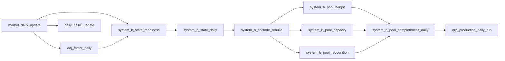

# 11 Pipeline全量注册表与生产编排

## 1. 目的和边界

本文是 QRP Atlas v1.1 的全量 Pipeline 注册基线。它不改变当前生产调度：Hermes 仍是全部 14 个现行 Job 的唯一调度权威；本轮没有启用 QRP Definition、安装 systemd、创建运行记录、执行生产任务或写入生产数据库。

机器可读真值是 [pipeline-registry.json](../../deploy/pipeline/pipeline-registry.json)。它为每项记录身份、当前状态、调度、确定性 argv（可证明时）、输入输出、完成标记、幂等语义、数据依赖、锁、超时、重试、新鲜度与性能预算。这里的 argv 仅描述历史/兼容 Definition 能力；正式 Pipeline Contract 由 `qrp-atlas-jobs serve` 的线程 worker 进程内执行。对正式 Contract，源码 `PipelineContract` 仍是业务语义唯一事实来源，注册表只记录全量盘点和迁移状态，不得覆盖源码规则。未知事实以 `UNRESOLVED` 或 `null` 保存，不以猜测补齐。

禁用的可执行候选定义位于 [pipeline-definitions.shadow.json](../../deploy/pipeline/pipeline-definitions.shadow.json)。该文件不是默认生产定义，所有条目均为 `enabled: false`，且没有被 scan 或 runner 使用。

## 2. 发现方法

本次逐项检查了：

- `~/.hermes/cron/jobs.json` 与其实际调用的 QRP 脚本；
- `src/qrp_atlas/pipeline/`、其余生产 CLI 入口及 `pyproject.toml` 的 console scripts；
- `scripts/`、`deploy/`、systemd 示例和当前已安装 unit；
- `docs/QRP产品蓝图v1.1/`、System B 迁移/表契约、`system_b_pool_run` 的 `COMPLETED` 完成标记；
- 定期报告、健康检查及运行时 Foundation 入口。

未读取或记录任何凭据值。当前主机没有安装 QRP Pipeline scheduler/runner unit；仓库内的 Pipeline 和 System B systemd 文件均是部署示例，不能据此推断其已启用。

## 3. 总览

| 状态 | 数量 | 含义 |
| --- | ---: | --- |
| `LEGACY_SCHEDULED` | 11 | 14 个 Hermes Job 映射出的可迁移能力；CNINFO、个股研报和行业研报的多个历史 Job 各自归并为一项业务能力，日更 Job 包含市场日更和 adj factor 两个阶段 |
| `READY_UNSCHEDULED` | 13 | 已有生产入口但当前未调度，包括 System B、手动回补和数据入口 |
| `SHADOW` | 0 | 不把“仍由 Hermes 调度”的生产状态改写为 SHADOW；其禁用 Definition 由单独字段/文件表达 |
| `PRODUCTION` | 0 | 尚无 QRP 正式调度 |
| `PLANNED` | 4 | 边界明确、尚未实现的检查或确定性替代能力 |
| `DEFERRED` | 0 | 无 |

共注册 28 条，排除 29 个已核查候选项。11 条旧能力使用 14 个 Hermes Job ID；已实现但未调度的条目为 13 条；Shadow Definition 为 6 条。

当前源码默认 catalog 中的二十条正式 Contract 包括六条已验收市场数据 Contract（`market_daily_update`、`adj_factor_daily`、`daily_basic_update`、`index_daily_update`、`zt_dt_pool_daily` 和 `suspend_d_ingest`）、两条基础资料 Contract（`index_basic_update`、`stock_basic_update`）、三条 Tushare 快照 Contract（`limit_step_ingest`、`ths_daily_ingest`、`stk_high_shock_ingest`）、一条 CNINFO 采集 Contract（`cninfo_research_visit_ingest`）、一条 IRM 最新问答增量 Contract（`irm_qa_incremental`）、两条成员关系历史 Contract（`industry_membership_ingest`、`index_component_ingest`）、三条 PIT/基本面/业绩预告 Contract（`pit_backfill`、`fundamentals_ingest`、`earnings_forecast_ingest`）、一条个股研究报告 Contract（`research_stock_report_ingest`）和一条行业研究报告 Contract（`research_industry_report_ingest`）。三个 Tushare 快照 Contract 按请求日期逐日读取 provider 响应，只接受完整日期快照，不提供 `ts_code`/`nums` 局部过滤；使用显式日期或日期范围、逐请求日期范围校验、`quant_db_writer`、单次事务和目标范围替换语义，分别写入 canonical `quant.db` 的 `limit_step`、`ths_daily` 和 `stk_high_shock` 表。provider 返回 `None` 或已有目标数据对应的空响应时 fail-closed；目标日期原本无数据的空响应不执行删除。Tushare endpoint 没有可靠的 total/page 证据，Contract 只对返回记录的范围和结构作 fail-closed 校验。两个研究报告 Contract 均使用显式 start/end 日期范围、完整东财列表/详情响应、数据库事务、run-scoped raw/canonical CSV 与 PDF 暂存提交、`quant_db_writer` 和 `overlap_policy=FORBID`；个股与行业历史早晚 Job 只是同一业务能力的调度事实，不再作为多个正式 `pipeline_id`。行业 Contract 的分类直接采用报告 provider 字段，不读取行业成员历史或行情表，也不执行成员/价格聚合。IRM 的真实语义是按请求时间扫描 P5W 最新 feed，以 `pid` 为唯一键增量追加；没有 provider 日期过滤或持久化水位线。成员关系 Contract 均只接受人工显式范围：行业成员使用 ticker 或 l1/l2/l3 行业代码（另有真实的 `is_new` 过滤），指数成分使用 index codes 与 start/end 日期；两者都不新增自动 schedule。CNINFO 的三个历史 Hermes Job（原 `main`、`noon`、`afternoon` 调度实例）只是同一业务能力的触发事实，不再作为正式 `pipeline_id`；不改写六条市场数据业务定义。所有写入 `quant.db` 的 Contract 均明确使用 `quant_db_writer`。本注册表中的 LEGACY/Shadow 状态描述历史生产或兼容 Definition，不等于 QRP 正式生产启用。

`task_type=AGENT_ORCHESTRATED` 的现行条目只有每日总结和每周健康检查。个股和行业研究报告现在均已有可移植的正式 Contract；任何 LLM 解释都不得作为数据 Pipeline 成功条件。

## 4. 全量注册表

下表是供评审阅读的索引；字段级完整记录、路径和入口证据以 JSON 注册表为准。`Q`、`E`、`P` 分别是 `quant.db`、`system_b_episode.duckdb`、`system_b_pools.duckdb`。`-` 代表没有 QRP 业务数据输出，`?` 代表 `UNRESOLVED`。

| Pipeline ID | 状态 / 类型 | 调度与当前权威 | 入口与核心输入输出 | 数据依赖 / 写锁 |
| --- | --- | --- | --- | --- |
| `market_daily_update` | LEGACY / DETERMINISTIC | 16:15 工作日 / Hermes `b8c670f02f9b` | `daily_update.run`; Tushare -> Q `daily_market_snapshot` | Tushare / `quant_db_writer` |
| `adj_factor_daily` | LEGACY / DETERMINISTIC | 同上（同一 shell 后续阶段） | `pull_adj_factor_daily.py`; Q calendar/history + Tushare -> Q `adj_factor_changes` | market daily / `quant_db_writer` |
| `cninfo_research_visit_ingest` | LEGACY / DETERMINISTIC | 历史 Hermes 调度事实：`83895a6a24a7`、`e56ff366b299`、`053db3ea5a9f` | `cninfo.run --date` 历史入口；CNINFO -> Q visits | CNINFO / `quant_db_writer` |
| `research_stock_report_ingest` | LEGACY / DETERMINISTIC | 历史调度事实：07:00 / `2b3c60fc1bcc`、19:00 / `cd3ce52ff14a` | `research_report_contracts` 进程内 executor；东财列表/详情/PDF -> Q `research_report_stock`、CSV/PDF | 显式日期范围 / `quant_db_writer` |
| `research_industry_report_ingest` | LEGACY / DETERMINISTIC | 历史调度事实：07:00 / `3591486225dc`、19:00 / `16a55246bddc` | `research_industry_contracts` 进程内 executor；东财行业列表/详情/PDF -> Q `research_report_industry`、CSV/PDF；分类取 provider 字段，不做成员/价格聚合 | 显式日期范围 / `quant_db_writer` |
| `pipeline_daily_summary_agent` | LEGACY / AGENT | 21:00 / `56d22829661c` | Hermes history -> Agent report | Hermes Agent / none |
| `system_health_weekly_agent` | LEGACY / AGENT | 周一 06:00 / `eadada323c3c` | host metrics -> Agent report | host + Hermes Agent / none |
| `index_daily_update` | LEGACY / DETERMINISTIC | 20:00 工作日 / `0450c10ccb5f` | `fetch_index_daily.py`; Tushare -> Q `index_daily` | Tushare / `quant_db_writer` |
| `zt_dt_pool_daily` | LEGACY / DETERMINISTIC | 15:30 工作日 / `3c40deda0c79` | `fetch_zt_dt_pool.py`; Tushare -> Q pools | Tushare / `quant_db_writer` |
| `daily_basic_update` | LEGACY / DETERMINISTIC | 17:15 工作日 / `4afb74bd0769` | `daily_basic.run`; Q snapshot + Tushare -> Q `daily_basic` | market daily / `quant_db_writer` |
| `irm_qa_incremental` | LEGACY / DETERMINISTIC | 每 5 分钟 08:00-21:59 / `3fdbd779c4da` | `irm_qa_contracts` 进程内 executor（`irm_qa.run` 为 Hermes 兼容入口）；P5W 最新 feed -> Q Q&A，`pid` 幂等追加 | P5W / `quant_db_writer` |
| `system_b_state_readiness` | READY / HEALTH_CHECK | 18:30 工作日示例 / none | `system-b readiness`; Q `stock_info`、`trading_calendar`、`daily_market_snapshot`、`adj_factor_changes`、`suspend_d` read-only | market daily + adj factor / none |
| `system_b_state_daily` | READY / DETERMINISTIC | 18:30 工作日示例 / none | `system-b run-daily`; Q state tables | readiness / `quant_db_writer` |
| `system_b_state_initialize` | READY / MANUAL | 人工 / none | `system-b initialize`; Q state tables | none / `quant_db_writer` |
| `system_b_episode_rebuild` | READY / DETERMINISTIC | ? / none | `system-b-episode`; Q -> E episode tables | state daily / `system_b_episode_writer` |
| `system_b_pool_height` | READY / DETERMINISTIC | ? / none | `system-b-pools HEIGHT`; Q + E -> P | episode / `system_b_pools_writer` |
| `system_b_pool_capacity` | READY / DETERMINISTIC | ? / none | `system-b-pools CAPACITY`; Q + E -> P | episode / `system_b_pools_writer` |
| `system_b_pool_recognition` | READY / DETERMINISTIC | ? / none | `system-b-pools RECOGNITION`; Q + E -> P | episode / `system_b_pools_writer` |
| `pit_backfill` | READY / MANUAL | 人工 / none | PIT backfill CLI; external/history -> Q PIT | Tushare / `quant_db_writer` |
| `suspend_d_ingest` | READY / DETERMINISTIC | ? / none | suspend-d CLI; Tushare -> Q `suspend_d` | Tushare / `quant_db_writer` |
| `industry_membership_ingest` | READY / MANUAL | 人工 / none | `membership_contracts` formal Contract；显式 ticker 或 l1/l2/l3 行业范围 -> Q `industry_membership_history` | Tushare + Q calendar / `quant_db_writer` |
| `index_component_ingest` | READY / MANUAL | 人工 / none | `membership_contracts` formal Contract；显式 index codes + start/end -> Q `index_component_history` | Tushare + Q calendar / `quant_db_writer` |
| `fundamentals_ingest` | READY / MANUAL | 人工 / none | fundamentals CLI -> Q financial tables | Tushare / `quant_db_writer` |
| `earnings_forecast_ingest` | READY / MANUAL | 人工 / none | earnings-forecast CLI -> Q revisions/runs | Tushare / `quant_db_writer` |
| `system_b_pool_completeness_daily` | PLANNED | ? | P `system_b_pool_run` -> health status | all three pools / none |
| `pipeline_daily_summary_deterministic` | PLANNED / REPORT | 21:00 | runtime SQLite -> deterministic report | runtime store / none |
| `system_health_weekly_deterministic` | PLANNED / HEALTH_CHECK | 周一 06:00 | runtime + host metrics -> health report | host metrics / none |
| `qrp_production_daily_run` | PLANNED | ? | accepted Definitions -> orchestration status | pool completeness / none |

所有 cron 使用 `Asia/Shanghai`。交易日语义是否由 cron 或真实交易日历决定，除现有代码已证明者外均未假设；以 `trading_days_only` 字段和 `UNRESOLVED` 明示。

## 5. 数据依赖与资源锁

图只表达已确认或明确规划的数据依赖，**不**因两个任务访问同一数据库而连线。外部 API 是各自采集任务的输入，不表示任务间依赖。

| 物理 DuckDB | 写入条目 | 排他锁 | 说明 |
| --- | --- | --- |
| `quant.db` | 所有现行市场、CNINFO、研究、指数、ZT/DT、daily-basic、IRM、System B state、各手动入库任务 | `quant_db_writer` | 正式 Contract 的同库写入统一使用整库 writer lock；`resource_reads` 可声明表级读取，读者不取写锁 |
| `system_b_episode.duckdb` | `system_b_episode_rebuild` | `system_b_episode_writer` | 独立于 `quant.db`，可与其写入并发但受数据依赖控制 |
| `system_b_pools.duckdb` | HEIGHT、CAPACITY、RECOGNITION | `system_b_pools_writer` | 三个 pool 是独立 Pipeline，但不能并发写同一输出文件 |

锁用于资源冲突，schedule 只表达业务时点。当前 Hermes 不使用这些 QRP 锁，因此 Shadow 仍不可作为并行生产接入。

正式 Contract 的表级 DuckDB 资源只能出现在 `resource_reads`，不能作为写锁满足生产写入要求。通用 Orchestration 锁引擎仍支持兼容 JSON Definition 的表级 `resource_locks`，用于维持兼容行为；这不改变正式 Contract 的数据库级写锁规则，本轮也不重构该通用引擎。

## 6. Shadow Definitions

| Pipeline | Definition 原因 | 不纳入的原因 |
| --- | --- | --- |
| `market_daily_update`、`adj_factor_daily`、`zt_dt_pool_daily`、`daily_basic_update`、`index_daily_update`、`irm_qa_incremental` | 历史上已证明为无参数、确定性 argv 的兼容 Definition | 全部 disabled；正式 source Contract 与兼容 Definition 分离，不能据此推导生产启用；其余历史 Definition 的 timeout/性能证据仍可能为空 |
| CNINFO 和研究报告 | CNINFO、个股研究报告和行业研究报告已有正式 source Contract | 当前没有经批准的部署参数模板/仓库 wrapper，因此不生成生产 Definition 或切换调度权 |
| System B state、episode、pools | 无 | CLI 需要 trade date、路径或范围；尚未定义生产配置和验收时点 |
| Agent summary/health | 无 | Agent prompt 不是确定性 CLI，且不应成为数据任务成功条件 |

Shadow 中 `/opt/qrp-atlas` 是现有 deploy 示例的目标安装路径，不是本机路径或启动指令。其环境继承只允许部署层提供配置；注册表只列环境变量名称，绝不包含值。

## 7. Hermes 迁移批次

以下是未来迁移设计，不是本轮动作。所有批次均先完成对应 Shadow/Definition 的 staging 验收，再在同一变更窗口进行 Hermes 停用与 QRP 启用；任一验收失败的回滚都是关闭新 Definition、保留或恢复原 Hermes Job，不回写业务数据。

| 批次 | Hermes Job | Pipeline ID | 关闭动作 / 启用动作 | 验收与回滚 |
| --- | --- | --- | --- | --- |
| 1 | `0450c10ccb5f`、`3c40deda0c79` | index、ZT/DT | 停 Hermes 后启用对应 QRP Definition | 对账表行数/新鲜度；关闭 QRP 并恢复 Hermes |
| 2 | `b8c670f02f9b`、`4afb74bd0769` | market、adj、daily-basic | 以三条依赖 Definition 替换日更 shell 与 daily-basic | 日快照、adj、basic 原子性和依赖成功；恢复两个 Hermes Job |
| 3 | `83895a6a24a7`、`e56ff366b299`、`053db3ea5a9f`、`3fdbd779c4da` | 一条 CNINFO 业务 Contract、IRM | 未来一个 Contract 对应多个调度 Job 的部署切换另行验收 | API 幂等和五分钟 overlap；恢复对应 Hermes Job |
| 4 | 四个研究 Job | 四个 research Pipeline | 先将动态日期 shell 转入仓库并验证 | 报告与表输出对账；恢复原四个 Job |
| 5 | `56d22829661c`、`eadada323c3c` | summary、health | 先实现确定性检查，再把 Agent 解释设为附加 | 报告不影响数据成功；恢复 Hermes Agent Job |

System B 没有 Hermes 映射。其首次接入按 `readiness/state -> episode -> HEIGHT/CAPACITY/RECOGNITION -> completeness` 顺序，每步独立验收并可停留在 disabled 状态。手动回补和其他数据入口不设定期 schedule，直到业务范围、参数和性能实测完成。

System B readiness 的五张真实输入表为 `stock_info`、`trading_calendar`、`daily_market_snapshot`、`adj_factor_changes` 和 `suspend_d`（`src/qrp_atlas/pipeline/system_b/repository.py:60-66`）。其中 `suspend_d` 当前只有未调度的 `suspend_d_ingest` 入口，没有正式日常更新链；它被登记为未闭合的新鲜度前置。正式启用 System B 前，必须二选一：接入可靠的 suspend_d 更新 Pipeline，或实现并验收能拒绝陈旧数据的 freshness check。

## 8. 排除清单

完整 29 项见 JSON 的 `exclusions`。按原因可归为：API/Auth 长驻服务和 config doctor（非周期任务）；`backfill_*`、`fetch_history_*`、`load_history_*`、`resume_backfill`（历史恢复）；`migrate_*`、`init_*`（一次性建库/迁移）；`canonicalize_*`、`fix_*`（数据修复）；`dump_*`、`verify_*`、`test_gateway*`（诊断或开发）；旧的 ad-hoc 日行情/adj 脚本（已由已注册能力覆盖）；带日期的一次性 PIT systemd 示例；以及非 QRP 的主机工具。排除不是遗漏，且不会把临时维护脚本自动提升为生产调度。

## 9. 未解决信息

- CNINFO、研究和 System B 的可移植 runtime 参数包装与实际工作目录；
- System B episode、三池、完整性检查的日常 schedule、超时、重试和新鲜度门槛；
- 除已明确 source-contract benchmark 的 Contract 外，所有任务的端到端 timeout、性能预算和历史耗时（目前没有可用测量历史）；
- 研究 Pipeline 的精确表级输入输出、失败传播和最终退出语义；
- Agent 报告中哪些内容应拆为确定性检查，哪些只保留解释用途；
- `zt_dt_pool_daily`、`daily_basic_update` 的精确重复执行/失败恢复语义。
- `suspend_d` 的日常更新与新鲜度证明；System B 在该前置关闭前不得启用。

这些事项不允许用 schedule 错峰或猜测的性能数字替代。

## 10. 正式迁移前验收清单

- [ ] 兼容 Definition 的 argv、部署工作目录、运行时日期/配置传递经 staging 验证；正式 Contract 已确认由 `serve` 线程 worker 进程内执行。
- [ ] 每条写任务的真实输出数据库和锁与注册表一致。
- [ ] 对同交易日重跑、失败重跑、依赖失败、overlap 和 lease 回收完成演练。
- [ ] timeout、retry、freshness 与性能预算以实测数据确定。
- [ ] 当前 Hermes Job 与 QRP Definition 逐条对账并完成可回滚变更单。
- [ ] System B state、episode、三池和 `COMPLETED` 完整性检查按顺序验收。
- [ ] Agent 解释从数据成功标准中剥离。
- [ ] 明确维护人、告警目标和回滚权限后，才允许启用 Definition。
