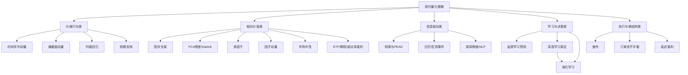

# 现代量化交易的经典策略分类研究

## 执行摘要

本报告按用户未指定项，默认研究区间为**近十年（约 2016-07 至 2026-07）**，覆盖**全球主要市场**（美股、A 股、期货、外汇、加密），并纳入**股票、期货、期权、外汇、加密**五类资产。为解释理论脉络，少量引用了十年前后的奠基论文；但对“现代量化”的判断、工程约束与实施建议，优先依据 2016 年以来的研究、官方文档和近年的行业资料。citeturn15view2turn16view1turn22search0turn21view6

结论上，现代量化策略可以归纳为八个核心策略族：**趋势/动量、均值回归、统计套利、因子投资、事件驱动、机器学习与强化学习、市场中性与套利、高频微结构**。若按“研究成熟度 + 可实现性 + 交易成本后可落地性”排序，最稳健的主线通常仍是：**趋势/动量、低频多因子、残差型统计套利、事件驱动**；而**强化学习和高频微结构**更多是“强工程、强数据、强基础设施”赛道，适合做执行、做市、库存管理或超短线预测，不应被误当成低门槛的万能 alpha。citeturn10view0turn10view2turn10view3turn10view5turn16view1turn10view8turn10view13

从收益来源看，动量吃的是**延续性与行为滞后**，均值回归与统计套利吃的是**价格偏离与残差收敛**，因子投资吃的是**风格风险溢价与特征定价**，事件驱动吃的是**信息扩散不充分**，套利吃的是**同一风险暴露的定价差**，高频策略吃的是**订单流、队列位置、做市价差和延迟差**。从工程现实看，**高换手策略最怕成本、借券、滑点和容量约束**；Novy-Marx 与 Velikov 对异常策略交易成本的系统整理显示，换手越高，净收益越容易被侵蚀，而低于约 50% 月换手的异常更有机会在成本后保留显著收益。citeturn10view0turn10view2turn10view3turn10view5turn21view4turn21view5turn15view2

就落地优先级而言，如果目标是搭建一套**可解释、可回测、可扩展**的现代量化框架，建议首先完成三层能力：其一，**统一数据与成本建模**；其二，**把策略按“信号—组合—执行”拆层**；其三，**先做低频、再做中频、最后做高频**。Zipline 文档明确支持滑点、手续费和订单延迟等现实要素；聚宽与掘金官方文档也都把滑点、手续费、成交比率等设为回测核心参数。这意味着“策略思想”本身并不够，**成本模型就是策略定义的一部分**。citeturn10view9turn18search0turn18search2

## 研究范围、假设与方法

本报告采用以下默认假设，并在未指定处显式补全：

- **时间范围**：近 10 年，约为 2016-07 至 2026-07；但为说明理论基础，允许引用更早的奠基文献。
- **市场范围**：全球主要市场，默认覆盖美股、A 股、期货、外汇、加密。
- **资产类别**：股票、期货、期权、外汇、加密。
- **实现语言**：Python。
- **回测框架**：未指定，默认含**滑点、手续费、订单延迟/成交约束**。
- **复杂度等级**：低/中/高为本文按**数据工程难度、模型复杂度、执行约束**做的主观工程分级，不是学术评级。
- **是否适合高频交易**：指策略是否天然依赖毫秒到秒级订单簿/撮合优势，而不是是否“可以被高频执行”。

方法上，本报告优先使用**原始论文、官方数据/文档、权威机构研究**。在实现层面，Python 生态主要参考：Pandas 的滚动与指数加权窗口函数、TA-Lib 的 Abstract API、Zipline 3.0 的事件驱动回测框架、CCXT 的统一加密交易接口；中文实现参考补充了聚宽和掘金的官方文档。Pandas 提供 rolling/ewm 等窗口计算；TA-Lib 的 Abstract API 可直接接入 pandas DataFrame；Zipline 3.0 明确支持滑点、交易成本与订单延迟；CCXT 提供单一 API 连接 100+ 交易所。citeturn2search3turn2search7turn10view11turn10view9turn10view10turn18search0turn18search2

一个现代量化研究框架，至少应把问题拆为四层：**信号构造、风险约束、组合构建、执行与成本**。这也是为什么同一学术因子在论文里可行，不代表在交易层面可直接照搬。MSCI 对“纯因子”组合的说明指出，这类理论上的市场中性组合往往需要成千上万只股票、近乎日频再平衡且高换手，实践中难以原样投资；AQR 关于实盘动量的研究也强调，能否通过组合设计和交易优化把学术溢价保留下来，是从“论文策略”到“真策略”的关键一步。citeturn21view1turn15view4

## 策略全景与比较

### 策略名单总表

下表按“核心策略族/常见子策略”列示现代量化交易的经典名单。**复杂度**和**是否适合高频**为本文工程判断；“代表依据”用于支撑该类别的理论或实证来源。

| 策略族/子策略 | 核心思想 | 适用资产 | 典型时间框架 | 复杂度 | 适合高频 | 代表依据 |
|---|---|---|---|---|---|---|
| 时间序列动量 | 买过去上涨、卖过去下跌；押注延续而非相对强弱 | 期货、外汇、股指、加密 | 日线到月线 | 低 | 否 | Moskowitz 等表明在股指、外汇、商品、债券期货上存在显著时间序列动量。citeturn10view0 |
| 横截面动量 | 买赢家卖输家，押注“相对强者继续强” | 股票、行业、加密截面 | 周线到月线 | 中 | 否 | 动量与长期反转可由条件风险暴露部分解释；但因子自相关也是核心。citeturn15view3turn15view0 |
| 均值回归/短期反转 | 价格偏离均值后回归；常利用过度反应或流动性补偿 | 股票、ETF、外汇、加密 | 分钟到日线 | 低 | 部分 | 投资者注意力与流动性提供都能增强/解释短期反转收益。citeturn17search1turn17search18 |
| 配对交易 | 对协整/相近资产做价差收敛 | 股票、ETF、期货跨期/跨品种 | 分钟到日线 | 中 | 部分 | Gatev 等给出经典“相对价值套利”配对交易框架。citeturn10view1 |
| PCA/残差统计套利 | 提取公共因子后交易残差均值回归 | 股票篮子、期货价差 | 日线到小时线 | 高 | 部分 | Avellaneda 与 Lee 用 PCA/行业 ETF 残差生成均值回归信号。citeturn10view2 |
| 多因子投资 | 以价值、质量、盈利、投资、动量等风格因子构建组合 | 股票、部分债券/信用 | 周线到月线 | 中 | 否 | Fama-French 五因子、Mispricing factors、QMJ 都是核心框架。citeturn10view3turn15view1turn23view1 |
| 因子动量/因子轮动 | 不是买股票赢家，而是买“近期强势因子” | 股票风格、行业、宏观风格 | 月线 | 高 | 否 | 2023 年 RFS 论文显示 factor momentum 可统摄多类特征动量。citeturn15view0 |
| 事件驱动/PEAD | 围绕财报、指导、分红、并购、宏观发布等事件交易 | 股票、期权、外汇、利率品 | 事件窗到数周 | 中 | 部分 | 盈利公告后漂移与新闻传播效率是主要理论基础。citeturn4search9turn4search0 |
| 新闻情绪/NLP | 把新闻、公告、社媒文本转为交易特征 | 股票、加密、外汇 | 分钟到数日 | 高 | 部分 | News-based trading 与 FinBERT 为该路线提供直接方法。citeturn10view5turn11view0 |
| 监督学习选股/预测 | 用高维特征、非线性与交互做收益预测 | 股票、债券、期权、加密 | 日线到月线 | 高 | 否 | Gu-Kelly-Xiu 显示树模型与神经网络可带来较大经济增益。citeturn22search0 |
| 强化学习 | 把交易建模为顺序决策，优化长期累计奖赏 | 组合配置、执行、做市、对冲 | 秒级到日线 | 高 | 部分 | 近年综述把 RL 重点归为配置、执行、期权对冲与做市。citeturn16view1turn10view13 |
| 市场中性 | 控制市场 Beta、行业或风格暴露，只保留选股 alpha | 股票、部分债券/期货篮子 | 日线到月线 | 中 | 否 | AQR 将其定义为多空平衡、接近零净市场暴露。citeturn21view0 |
| ETF/期现/跨所套利 | 利用 ETF-NAV、现货-期货、跨交易所错价 | ETF、期货、加密 | 秒级到日线 | 高 | 部分 | ETF 的申赎机制、期货到期收敛和永续资金费率都提供基础。citeturn21view4turn21view7turn21view5 |
| 波动率套利 | 交易隐含波动率与实现波动率、方差风险溢价差 | 期权、波动率期货 | 日线到周线 | 高 | 否 | 方差风险溢价可由一篮子期权近似，成为波动率套利基石。citeturn21view8turn20search1 |
| 高频做市 | 在最优报价附近挂单，赚点差并控库存风险 | 股票、期货、加密 | 毫秒到秒 | 高 | 是 | 做市的核心是点差捕获、库存约束与逆向选择管理。citeturn1search5turn21view6 |
| 订单流/微结构预测 | 用 OFI、队列、撤单、盘口深度预测极短线价格 | 股票、期货、加密 | 毫秒到分钟 | 高 | 是 | Cont 等显示短期价格变化主要由订单流不平衡驱动。citeturn10view8 |
| 延迟套利/抢跑 | 利用行情延迟、消息处理与网速差 | 股票、期货 | 微秒到毫秒 | 极高 | 是 | Aquilina 等量化了 HFT “latency arbitrage” 的竞速特征。citeturn10view7 |

### 策略分类层级与关系图

下图是一个偏工程落地的分类图：把“信号来源”与“执行方式”同时纳入，而不是只按学术门类切分。该分法综合了因子文献、统计套利、事件研究、RL 综述以及微结构研究。citeturn10view2turn10view3turn10view5turn16view1turn10view8



### 策略比较表

下表对**核心策略族**做横向比较；“收益来源/数据需求/资源需求”等为文献与工程经验综合归纳，最后一列给出代表证据。

| 策略族 | 主要收益来源 | 典型回撤特征 | 交易频率 | 数据需求 | 计算资源 | 可解释性 | 易实现性 | 代表证据 |
|---|---|---|---|---|---|---|---|---|
| 动量 | 趋势延续、行为滞后、慢变量扩散 | 容易在急剧反转时集中回撤 | 中 | OHLCV 即可起步 | 低到中 | 高 | 高 | TSMOM 在多资产期货有效，但存在 momentum crashes。citeturn10view0turn6search0 |
| 均值回归 | 过度反应修正、流动性补偿 | 趋势市中连续止损 | 中到高 | 高频价格/成交量更佳 | 低到中 | 高 | 高 | 反转与流动性提供、注意力冲击密切相关。citeturn17search1turn17search18 |
| 统计套利 | 残差收敛、公共因子剥离后的错价 | 关系失效时大幅回撤 | 中 | 面板数据、协整/PCA | 中到高 | 中到高 | 中 | 配对与 PCA 残差框架是经典主线。citeturn10view1turn10view2 |
| 因子投资 | 风格风险溢价、特征定价 | 因子寒冬可能持续多年 | 低到中 | 基本面 + 行情 + 风格暴露 | 中 | 高 | 中到高 | FF-5、QMJ、Factor Momentum 与多因子实践均支持该类。citeturn10view3turn23view1turn15view0turn23view0 |
| 事件驱动 | 信息到价格的延迟映射 | 跳空风险、单事件尾部风险 | 低到中 | 事件日历、公告/新闻文本 | 中 | 中到高 | 中 | PEAD 与新闻情绪策略均有长期证据。citeturn4search9turn10view5turn11view0 |
| 机器学习 | 非线性、交互项、高维表征 | 过拟合和失效常表现为“回测强、实盘弱” | 低到中 | 大规模面板或多模态数据 | 高 | 中到低 | 中到低 | Gu-Kelly-Xiu、A 股 ML 研究与 2026 反偏差论文都给出边界条件。citeturn22search0turn16view0turn22search14 |
| 强化学习 | 顺序决策中的长期奖赏优化 | 奖励函数失真会导致策略崩塌 | 中到高 | 环境仿真 + 状态/动作/奖赏设计 | 高 | 低到中 | 低 | RL 更适合配置、执行、对冲、做市，而不是无约束地“直接找 alpha”。citeturn16view1turn10view13 |
| 套利 | 同一风险暴露的定价差、收敛机制 | 尾部风险来自腿部失衡与融资约束 | 中到高 | 多市场同步行情、费率/持仓/保证金 | 中到高 | 高 | 中 | ETF 申赎、期现收敛、永续资金费率和方差风险溢价都有机制支撑。citeturn21view4turn21view7turn21view5turn21view8 |
| 高频微结构 | 点差、订单流、队列位置、延迟差 | 小亏多次、偶发大亏、强逆选风险 | 极高 | Tick/订单簿/消息级数据 | 极高 | 中到低 | 低 | OFI、Hawkes 与 latency arbitrage 研究都指向其“强数据 + 强基础设施”属性。citeturn10view8turn7search13turn10view7 |

## 趋势与反转策略

### 动量策略

**实现要点摘要：** 先定义形成期收益，再做波动率缩放和持仓标准化；回测时必须把换手、滑点和再平衡频率一起建模，否则会高估可实现收益。citeturn10view0turn15view4turn15view2

```python
import pandas as pd, numpy as np

# price: DataFrame, columns are symbols, daily close
ret = price.pct_change()
lookback = 252       # 12个月动量
vol_win = 20         # 1个月波动率
fee_bps = 5 / 10000  # 单边5bps

mom = price.pct_change(lookback)
vol = ret.rolling(vol_win).std() * np.sqrt(252)

raw_signal = np.sign(mom) / vol
weight = raw_signal.div(raw_signal.abs().sum(axis=1), axis=0).shift(1)

gross_ret = (weight * ret).sum(axis=1)
turnover = weight.diff().abs().sum(axis=1)
cost = turnover * fee_bps
net_ret = gross_ret - cost
equity = (1 + net_ret.fillna(0)).cumprod()
```

理论上，时间序列动量最适合**流动性较好、可做多做空、可跨资产分散**的市场，典型是股指、利率、商品、外汇和加密永续/期货。学术证据显示，它在 58 个流动性期货上存在 1 至 12 个月的延续，并且在极端市场通常表现更好；但动量也会在剧烈风格反转或市场再定价阶段出现集中回撤。工程上，最关键参数是形成窗、持有窗、波动率目标、再平衡频率与仓位上限；改进方向包括**残差动量、行业动量、因子动量、趋势分位过滤**。citeturn10view0turn6search0turn15view0turn15view3

### 均值回归策略

**实现要点摘要：** 用均值与偏离度定义进入/退出；核心不是“价格跌了就买”，而是只在流动性足、价差可收敛、趋势过滤通过时做反转。citeturn17search1turn17search18turn10view1

```python
import pandas as pd
from talib import BBANDS

# close: Series
upper, mid, lower = BBANDS(close.values, timeperiod=20, nbdevup=2, nbdevdn=2)
band = pd.DataFrame({"c": close, "u": upper, "m": mid, "l": lower}).dropna()
z = (band["c"] - band["m"]) / (band["u"] - band["m"]).replace(0, pd.NA)

long_entry  = z < -1.0
long_exit   = z > -0.2
short_entry = z >  1.0
short_exit  = z <  0.2

pos = pd.Series(0, index=band.index)
pos[long_entry] = 1
pos[short_entry] = -1
pos = pos.replace(0, pd.NA).ffill().fillna(0)
pos[long_exit | short_exit] = 0
pos = pos.ffill().fillna(0).shift(1)

ret = band["c"].pct_change().fillna(0)
net = pos * ret - pos.diff().abs().fillna(0) * 0.0005
equity = (1 + net).cumprod()
```

均值回归更适合**高流动性、噪声较多、做市力量强**的标的，如大型股票、ETF、股指/商品短线、外汇和部分加密。参数上重点看：回看窗、偏离阈值、趋势过滤、最大持有时长和止损。风险在于，很多“回归”其实是在**抄底趋势**；因此常见改进是加上**趋势滤网、成交量/波动率过滤、残差化处理、盘中时段过滤**。若把均值回归上升为“相对价值”，就进入配对交易和统计套利。citeturn17search1turn17search18turn17search7turn10view1

## 相对价值与因子策略

### 统计套利策略

**实现要点摘要：** 先构造稳定价差，再判断偏离是否可收敛；真正难点不在 z-score，而在配对选择、半衰期估计、借券与关系失效监控。citeturn10view1turn10view2turn21view0

```python
import pandas as pd, numpy as np

# x, y: 两只股票收盘价 Series
window = 120
beta = (y.rolling(window).cov(x) / x.rolling(window).var()).dropna()
spread = (y.loc[beta.index] - beta * x.loc[beta.index]).dropna()

mu = spread.rolling(60).mean()
sd = spread.rolling(60).std()
z = (spread - mu) / sd

pos_y = pd.Series(0.0, index=z.index)
pos_x = pd.Series(0.0, index=z.index)

entry_long  = z < -2
entry_short = z >  2
exit_all    = z.abs() < 0.5

pos_y[entry_long]  =  1
pos_x[entry_long]  = -beta[entry_long]
pos_y[entry_short] = -1
pos_x[entry_short] =  beta[entry_short]

pos_y = pos_y.replace(0, np.nan).ffill().fillna(0)
pos_x = pos_x.replace(0, np.nan).ffill().fillna(0)
pos_y[exit_all] = 0
pos_x[exit_all] = 0

ret = pos_y.shift(1)*y.pct_change().reindex(z.index) + pos_x.shift(1)*x.pct_change().reindex(z.index)
```

统计套利的理论核心是：**把共同行情拆掉，只交易残差**。最基础的是配对交易，进一步是行业篮子、PCA 残差、ETF 残差、状态切换/HMM 残差。Avellaneda 与 Lee 的经典做法恰是用 PCA 或行业 ETF 解释共性，然后把剩余的 idiosyncratic component 当成均值回归对象。关键参数包括配对筛选规则、滚动回归窗、协整/半衰期阈值、入场/出场 z 分数、持仓上限与停损。最大风险不是“噪声”，而是**关系断裂、拥挤交易、借券成本与流动性抽离**。citeturn10view1turn10view2turn21view0

### 因子投资策略

**实现要点摘要：** 先做可交易股票池，再对因子做去极值、标准化、中性化和合成评分；收益通常来自长期、纪律化暴露，而不是高频调参。citeturn10view3turn23view0turn21view1

```python
import pandas as pd

# df columns: ['bm','roe','mom_12m','mcap','sector']
# index: MultiIndex(date, asset)
def zscore(x):
    return (x - x.mean()) / x.std()

g = df.groupby(level=0)
score = (
    g["bm"].transform(zscore) +
    g["roe"].transform(zscore) +
    g["mom_12m"].transform(zscore)
)

# 简单市值中性权重：买前20%，卖后20%
rank = score.groupby(level=0).rank(pct=True)
longs = (rank >= 0.8).astype(int)
shorts = (rank <= 0.2).astype(int) * -1
raw = longs + shorts

w = raw.groupby(level=0).apply(lambda s: s / s.abs().sum())
w = w.droplevel(0).shift(1)  # 防未来函数
```

因子投资最稳健的框架仍是**横截面排序 + 组合约束**。Fama-French 五因子把盈利与投资正式并入经典框架；Stambaugh 与 Yuan 的 mispricing factors 把多类异常聚类为更简洁的误定价因子；AQR 的 QMJ 则把质量因子实盘化。近年的一个关键信号是：**因子本身也有动量**，即因子收益有惯性，因而“因子轮动/因子动量”成为现代多因子中的重要扩展。另一方面，MSCI 也提醒，理论上的“纯因子、全中性、最小风险”组合往往高换手且难以直接投资。调参重点包括：股票池过滤、因子滞后、行业/市值/Beta 中性、再平衡频率与换手约束。citeturn10view3turn15view1turn23view1turn15view0turn21view1turn23view0

## 事件、机器学习与决策型策略

### 事件驱动策略

**实现要点摘要：** 事件驱动靠“新信息如何被定价”赚钱；关键不是事件本身，而是** surprise 如何量化、多久扩散、是否有拥挤与跳空风险**。citeturn4search9turn10view5turn11view0

```python
import pandas as pd

# events: columns ['date','asset','earnings_surprise','sentiment']
# daily_ret: MultiIndex(date, asset) -> next-day return
evt = events.copy()
evt["score"] = 0.7 * evt["earnings_surprise"] + 0.3 * evt["sentiment"]

# 只买上分位、卖下分位
evt["pct"] = evt.groupby("date")["score"].rank(pct=True)
evt["signal"] = 0
evt.loc[evt["pct"] >= 0.8, "signal"] = 1
evt.loc[evt["pct"] <= 0.2, "signal"] = -1

# 事件后持有5日（示意）
hold = evt[["date","asset","signal"]].copy()
hold["exit_date"] = hold["date"] + pd.Timedelta(days=5)
```

事件驱动主要分两大支：一类是**规则型事件**，如财报、业绩预告、分红、并购、指数调整、宏观数据发布；另一类是**文本型事件**，把新闻、公告、电话会或社媒转成情绪与主题信号。研究表明，新闻情绪能够被纳入自动化交易系统；同时，FinBERT 这类金融领域预训练模型在金融文本情绪任务上优于通用模型。对 PEAD 而言，信息传播效率越高，漂移通常越弱，这也是为什么很多事件策略会随资讯基础设施改善而被压缩。参数上应重点控制：事件窗定义、惊喜度标准化、持有天数、跳空成本、停牌/涨跌停约束。citeturn10view5turn11view0turn4search9

### 机器学习策略

**实现要点摘要：** 用机器学习做量化，不是“让模型自己找圣杯”，而是把高维特征映射成可交易排序，并用滚动训练、时间切分和成本约束防止幻觉收益。citeturn22search0turn16view0turn22search14

```python
import pandas as pd
from sklearn.ensemble import RandomForestRegressor

# X: MultiIndex(date, asset) features; y: next-period return
dates = sorted(X.index.get_level_values(0).unique())
preds = []

for i in range(24, len(dates)-1):
    train_dates = dates[i-24:i]      # 24期滚动训练
    test_date = dates[i]

    X_tr = X.loc[train_dates]
    y_tr = y.loc[train_dates]
    X_te = X.loc[[test_date]]

    model = RandomForestRegressor(
        n_estimators=200, max_depth=6, random_state=42, n_jobs=-1
    )
    model.fit(X_tr, y_tr)
    p = pd.Series(model.predict(X_te), index=X_te.index)
    preds.append(p)

pred = pd.concat(preds).sort_index()
signal = pred.groupby(level=0).rank(pct=True)
```

Gu、Kelly、Xiu 在 RFS 的经典研究表明，树模型和神经网络能通过**非线性与特征交互**带来显著经济增益；而在中国市场，Leippold 等发现**流动性**是更重要的预测变量之一，且交易成本后仍有经济意义。现代机器学习量化更像是**特征工程 + 严格验证 + 组合约束**三件事，而不是单纯比拼模型复杂度。最关键的工程原则是：**时间切分、滚动训练、特征滞后、去未来函数、成本后评估**。2025 年关于 look-ahead bias 的研究也提醒，很多看似惊艳的 ML alpha，去掉偏差后会大幅衰减。citeturn22search0turn16view0turn22search14turn22search8

### 强化学习策略

**实现要点摘要：** 强化学习更适合“如何连续决策”而不是“是否存在横截面 alpha”；最能发挥优势的场景是执行、库存管理、做市和动态对冲。citeturn16view1turn10view13

```python
# 伪代码：RL 交易环境
state = [positions, cash, features_t, risk_state]
for t in market_env:
    action = agent.policy(state)   # 例如目标仓位/买卖量/挂单价格
    fill, cost = env.execute(action)
    reward = pnl(fill) - cost - risk_penalty(fill.inventory)
    next_state = env.observe()
    agent.update(state, action, reward, next_state)
    state = next_state
```

近年的综述把 RL 的主要金融应用归纳为**组合配置、交易执行、期权对冲、市场做市**。这一定义非常重要：RL 的强项在于**多阶段、多目标、带约束的连续控制**，而不是天然优于所有监督学习选股。FinRL-Meta 进一步指出，金融市场对 RL 的难点是**信噪比低、幸存者偏差、历史回测过拟合、环境难以真实模拟**。因此，若你的目标是构造股票横截面 alpha，监督学习通常更稳；若目标是“在既定 alpha 下怎样分时执行、控库存、控冲击”，RL 才更自然。citeturn16view1turn10view13

## 市场中性、套利与高频策略

### 市场中性策略

**实现要点摘要：** 市场中性不是独立 alpha，而是把 alpha 从市场方向中剥离出来；核心在暴露约束、杠杆管理与借券/融资成本控制。citeturn21view0turn21view1

```python
import pandas as pd
import numpy as np

# score: 选股得分; beta: 对市场beta估计
rank = score.groupby(level=0).rank(pct=True)
longs = (rank >= 0.8).astype(float)
shorts = (rank <= 0.2).astype(float) * -1
w = longs + shorts

# 归一化 gross exposure
w = w.groupby(level=0).apply(lambda s: s / s.abs().sum()).droplevel(0)

# beta 中性：按当日beta调整
port_beta = (w * beta).groupby(level=0).sum()
w_adj = w - beta * port_beta.reindex(w.index.get_level_values(0)).values
```

AQR 将股票市场中性定义为：通过同时做多和做空股票，并把净市场暴露控制在接近零，从而把收益尽量锁定为选股 alpha。该类策略常与多因子、统计套利、行业配对、可转债/资本结构相对价值结合。参数重点包括净敞口、总杠杆、行业/国家/风格中性、单名权重、借券可得性、融资成本和再平衡门槛。其回撤多来自**因子拥挤、风格错杀、短端逼空、融资约束和模型失配**。citeturn21view0turn21view1turn19search3

### 套利策略

**实现要点摘要：** 套利的本质是利用**收敛机制已知**的价差，而不是盲目赌“便宜会更便宜”；真正关键是腿部风险、资金占用、清算与结算细节。citeturn21view4turn21view7turn21view5turn21view8

```python
import pandas as pd

# spot, fut: Series；T 为到期剩余年化时间
basis = fut / spot - 1
annualized_basis = basis / T

entry = annualized_basis > 0.08    # 年化基差超过8%
exit_ = annualized_basis < 0.02

pos_spot = pd.Series(0, index=spot.index)
pos_fut  = pd.Series(0, index=spot.index)

pos_spot[entry] = 1      # 买现货
pos_fut[entry]  = -1     # 卖期货
pos_spot[exit_] = 0
pos_fut[exit_]  = 0

pos_spot = pos_spot.replace(0, pd.NA).ffill().fillna(0)
pos_fut  = pos_fut.replace(0, pd.NA).ffill().fillna(0)
```

套利至少可分四类：**ETF 申赎套利、期现/跨期套利、永续资金费率/基差套利、波动率套利**。ETF 之所以能长期贴近 NAV，本质上就依赖授权参与者的申赎套利；期货到期靠交割机制与“买现货卖期货/买期货接货卖现货”的无风险收敛保持贴现一致；加密永续依赖资金费率把永续价格拉回现货；而波动率套利则围绕“隐含波动率—实现波动率—方差风险溢价”展开。实践中，套利并非没有风险：**资金费率会翻向、跨所转账会延迟、现货借贷/保证金会收紧、期权波动率会长期高估或低估**。所以套利本质上是**收敛交易 + 融资/执行管理**。citeturn21view4turn21view7turn21view5turn21view6turn21view8turn20search1

### 高频微结构策略

**实现要点摘要：** 高频策略真正交易的不是“价格趋势”，而是订单流、盘口深度、队列位置、库存与延迟；没有订单簿数据和低延迟基础设施，不建议把它当主路线。citeturn10view8turn10view7turn7search13

```python
# 伪代码：基于订单流不平衡 OFI 的超短线交易
for each event_t:
    ofi = d_bid_size - d_ask_size
    depth = bid_size + ask_size
    signal = ofi / max(depth, 1)

    if signal > th_buy and inventory < inv_cap:
        place_buy_limit(best_bid)
    elif signal < -th_sell and inventory > -inv_cap:
        place_sell_limit(best_ask)

    if adverse_selection_detected or holding_time > max_horizon:
        cancel_or_cross()
```

按照 Cont 等的结果，短时间内价格变化与**订单流不平衡（OFI）**近似线性相关，而斜率与市场深度成反比；这就是许多盘口预测策略、做市 skew 和库存敏感报价的基础。更极端的高频行为是**延迟套利**：QJE 2022 的研究用交易所消息数据发现，类似竞速场景在 FTSE 100 个股上大约可达“每个品种每分钟一次”，且模态持续时间仅 5–10 微秒。另一方面，Hawkes/LOB 深度模型之所以流行，也正因为高频数据规模可达**数十亿事件**。因此，这类策略只在满足三条件时有意义：**订阅级别足够深、撮合链路足够快、交易所费用结构可承受**。citeturn10view8turn10view7turn7search13

## 实施建议与优先参考来源

从研究到实盘，最重要的不是“会不会写信号”，而是能否把**数据版本、成本、组合与执行**稳定连接起来。实践中建议遵循以下顺序：先搭建统一数据层与回测框架，再做低频/中频策略，最后才考虑高频。Zipline 3.0 的文档强调其事件驱动、可建模滑点/交易成本/订单延迟；Pandas 与 TA-Lib 足够支撑大部分低频和中频原型；加密做撮合和多交易所接入时，CCXT 是常见统一入口；A 股研究与回测可以参考聚宽、掘金等中文官方文档。citeturn10view9turn10view10turn10view11turn18search0turn18search2

另一个常被忽略的问题是**数据版本管理**。Kenneth French Data Library 在 2025 年起因为 CRSP 格式变更而调整了美国因子收益的生成过程；而 2026 年的研究进一步指出，Fama-French 因子会随下载时间和生产方法变化而发生可观漂移。对多因子、因子动量、机器学习研究而言，这意味着：**你不仅要记住“用了什么因子”，还要记录“因子是哪一天下载的、按什么规则生产的”**。citeturn10view12turn1search7

若按“适合个人/独立研究者”的优先级排序，我的建议是：**先做趋势/动量 + 多因子 + 简单事件驱动；再做配对/残差套利；最后才碰 RL 和 HFT**。原因不是后两者不先进，而是它们对样本质量、环境真实性、算力、延迟和基础设施的要求显著更高。RL 的主战场更适合执行、做市和库存管理，高频策略则必须建立在订单簿级数据和现实成本模型之上。citeturn16view1turn10view13turn10view8turn10view7

如果需要代码运行环境，本文建议的**经验配置**如下：日线/周线趋势与多因子至少覆盖多个市场状态；事件驱动要有完整事件日历与公告时间戳；统计套利至少需要较长的滚动窗来估计稳定关系；高频与 RL 则要用更高频率、更大样本、并记录撮合与交易成本细节。特别是高频场景，文献已经明确出现“数十亿事件”级别的数据处理问题。citeturn7search13turn10view13

优先参考的来源如下，按“原始论文/官方文档/权威实践”混合排序：

| 来源 | 类型 | 用途 |
|---|---|---|
| *Time Series Momentum*，Moskowitz, Ooi, Pedersen (JFE, 2012) citeturn10view0 | 论文 | 趋势/时间序列动量的经典起点 |
| *Statistical Arbitrage in the U.S. Equities Market*，Avellaneda & Lee (2010) citeturn10view2 | 论文 | PCA/残差统计套利的代表文献 |
| *Dissecting Anomalies with a Five-Factor Model*，Fama & French (2016) citeturn10view3 | 论文 | 多因子与风格收益的核心框架 |
| *Empirical Asset Pricing via Machine Learning*，Gu, Kelly, Xiu (RFS, 2020) citeturn22search0 | 论文 | 机器学习量化的标志性论文 |
| *Machine Learning in the Chinese Stock Market*，Leippold, Wang, Zhou (JFE, 2022) citeturn16view0 | 论文 | A 股/中国市场机器学习与成本问题 |
| *A Survey on Recent Advances in Reinforcement Learning for Intelligent Investment Decision-Making Optimization* (2025) citeturn16view1 | 综述论文 | RL 在配置、执行、对冲、做市中的全景 |
| *Price Impact of Order Book Events*，Cont, Kukanov, Stoikov (JFEC, 2014) citeturn10view8 | 论文 | OFI、盘口深度与微结构预测 |
| *Quantifying the High-Frequency Trading Arms Race*，Aquilina et al. (QJE, 2022) citeturn10view7 | 论文 | 延迟套利与竞速高频的现实约束 |
| Kenneth French Data Library citeturn10view12 | 官方数据/文档 | 因子回测、研究复现与版本管理 |
| Zipline 3.0 Docs / CCXT Docs / TA-Lib Python Docs / 聚宽 API / 掘金回测文档 citeturn10view9turn10view10turn10view11turn18search0turn18search2 | 官方文档 | Python 实现、回测、交易成本与加密接入 |

总体而言，现代量化交易并不是“模型越新越强”，而是**越能把信号、风险、成本和执行闭环起来，越接近真实可交易策略**。在这条主线上，经典策略并没有过时；真正变化的是它们今天必须在更严格的成本、更复杂的数据和更细分的市场结构下被重新实现。citeturn15view4turn15view2turn23view0turn10view7