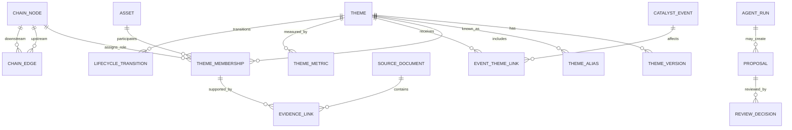

# 动态产业-题材库：数据基座需求

> 本文是需求与契约设计，不是建表迁移。实现时仍遵循 QRP `pipeline → contracts → DuckDB → indicators → API` 边界。

## 1. 设计目标

- 同时表达稳定行业、产业链关系和动态题材；
- 保存来源原貌、QRP 标准实体和派生指标之间的完整血缘；
- 支持 point-in-time 查询、双时态修订和历史回放；
- 支持多来源冲突、未知、不确定和人工审核；
- 为 Web、告警、研究回测和 AI Agent 提供同一数据契约；
- 首期适配 DuckDB，不依赖图数据库或消息队列才能运行。

## 2. 数据分层

```text
L0 Source Snapshot
  原始响应、请求参数、来源时间、内容哈希、授权元数据

L1 Canonical Fact
  标准实体、事件、来源文档、供应商成员快照、行情事实

L2 Curated Knowledge
  QRP 题材版本、产业链关系、成员关系、证据与审核决策

L3 Derived Signal
  指标、生命周期、变化事件、告警、摘要

L4 Serving View
  今日总览、题材详情、成员视图、时间轴、Agent 工具结果
```

L0/L1 只能通过 pipeline 和 contracts 写入；L2 的人工/Agent 操作先生成 proposal，经审核器提交；L3 可由固定输入重算；L4 不保存新的业务真相。

## 3. 实体关系



## 4. 核心表需求

字段类型在实现时映射到现有 contracts 风格；下表只列业务字段。

### 4.1 来源与批次

#### `source_registry`

```text
source_id, source_name, source_tier, source_type,
license_scope, retention_policy, redistribution_policy,
default_timezone, enabled, config_version
```

#### `ingestion_run`

```text
run_id, source_id, endpoint, business_date,
request_fingerprint, started_at, finished_at,
observed_until, status, row_count, error_code,
schema_version, code_version
```

#### `source_snapshot`

```text
snapshot_id, run_id, source_id, external_id,
business_date, observed_at, source_updated_at,
request_params_json, payload_ref_or_json, content_hash,
revision_id, is_complete, license_tag
```

原始全文能否落库由 `retention_policy` 决定；不可保存时仅存允许字段、摘要、内容哈希和可回访 URL。

### 4.2 来源文档与事件

#### `source_document`

```text
document_id, source_id, external_id, document_type,
title, canonical_url, publisher, author,
published_at, available_at, observed_at, ingested_at,
language, summary, content_ref, content_hash,
revision_id, supersedes_document_id, license_tag
```

#### `source_excerpt`

```text
excerpt_id, document_id, locator_type, locator_value,
quote_text_or_hash, normalized_text, created_at
```

`locator_value` 可以是页码、段落、字符区间或结构化字段路径。若授权不允许存储原文，保存哈希、短摘要和定位信息。

#### `catalyst_event`

```text
event_id, event_type, normalized_title, event_status,
event_time, published_at, available_at,
expected_end_at, actual_end_at, geography,
impact_direction, confidence, canonical_fingerprint,
created_by, created_at
```

同一现实事件可对应多条 source document；事件去重不删除来源差异。

### 4.3 分类、题材与别名

#### `taxonomy_node`

```text
node_id, taxonomy_type, classification_system,
node_code, node_name, parent_node_id, level,
valid_from, valid_to, source_id, version
```

`taxonomy_type`：`industry`、`chain_stage`、`product`、`technology`、`application`、`policy_domain`。

#### `industry_chain_edge`

```text
edge_id, from_node_id, to_node_id, relation_type,
direction, strength, evidence_status,
effective_from, effective_to,
valid_from, valid_to, source_id, version
```

#### `theme`

```text
theme_id, canonical_name, theme_type, current_version_id,
created_at, created_by, status, merged_into_theme_id
```

`theme_type` 示例：政策、技术、产品、涨价、供需、事件、地域、改革。类型是研究维度，不等于供应商分类。

#### `theme_version`

```text
theme_version_id, theme_id, version_no,
name, short_definition, inclusion_rule, exclusion_rule,
parent_theme_id, valid_from, valid_to,
effective_from, effective_to,
change_reason, proposal_id, created_by, created_at
```

`valid_*` 表示 QRP 何时认可该版本，`effective_*` 表示版本描述的业务有效区间；两者不可混用。

#### `theme_alias`

```text
alias_id, theme_id, alias, alias_type, source_id,
effective_from, effective_to, valid_from, valid_to,
match_confidence, review_status
```

别名可包括供应商名、市场简称、旧称和英文名。同一 alias 映射多个 theme 时必须进入冲突审核。

#### `source_theme_snapshot`

```text
source_id, source_theme_code, source_theme_name,
trade_date, metric_payload_json, snapshot_id,
first_observed_at, last_observed_at
```

该表保留供应商口径，绝不直接替代 `theme`。

### 4.4 公司-题材关系与证据

#### `theme_membership`

```text
membership_id, theme_id, asset_id, chain_node_id,
role_type, membership_status,
business_relevance_score, relevance_coverage,
first_observed_at, last_observed_at,
effective_from, effective_to,
valid_from, valid_to,
origin_type, origin_id, version,
review_status, reviewed_by, reviewed_at
```

`membership_status`：`core`、`follower`、`sentiment`、`watch`、`excluded`。它是产品身份，不是供应商给出的标签。

#### `evidence_claim`

```text
claim_id, subject_type, subject_id, predicate,
object_type, object_id_or_value, unit,
claim_direction, confidence,
effective_from, effective_to,
valid_from, valid_to,
extraction_method, model_version,
review_status
```

`claim_direction`：`support`、`contradict`、`neutral`。否认、澄清和业务终止不得被覆盖掉。

#### `evidence_link`

```text
claim_id, document_id, excerpt_id,
source_independence_group, evidence_weight,
created_at
```

转载同一原始消息的十家媒体应属于同一个 `source_independence_group`，不能当作十条独立证据。

### 4.5 指标、状态与变化

#### `theme_metric_observation`

```text
theme_id, metric_code, frequency, as_of,
value, coverage, component_json,
input_manifest_id, calculation_version,
status, created_at
```

#### `theme_lifecycle_transition`

```text
transition_id, theme_id, from_state, to_state,
proposed_at, effective_at, confirmed_at,
trigger_rule_id, trigger_payload_json,
input_manifest_id, model_or_rule_version,
override_reason, expires_at
```

#### `theme_change_event`

```text
change_event_id, theme_id, change_type,
occurred_at, detected_at, severity,
before_json, after_json, explanation_code,
evidence_ids, input_manifest_id, dedupe_key
```

### 4.6 订阅、告警与审核

#### `monitor_subscription`

```text
subscription_id, owner_id, target_type, target_id,
condition_json, severity_floor, schedule,
channel, enabled, created_at
```

#### `monitor_alert`

```text
alert_id, subscription_id, change_event_id,
severity, title, reason_json, status,
first_triggered_at, last_updated_at,
delivered_at, acknowledged_at, dedupe_key
```

#### `proposal`

```text
proposal_id, proposal_type, target_type, target_id,
before_json, proposed_json, rationale,
evidence_ids, created_by_type, created_by_id,
agent_run_id, status, created_at, expires_at
```

#### `review_decision`

```text
decision_id, proposal_id, action, reason_code, comment,
reviewer_id, decided_at, resulting_version_id
```

#### `agent_run`

```text
agent_run_id, task_type, requester_id, prompt_template_version,
input_scope_json, tool_policy_version, model_id,
started_at, finished_at, status, cost_usage_json,
tool_trace_ref, output_json, citation_check_status
```

## 5. 时间契约

### 5.1 必备时间字段

| 字段 | 含义 |
| --- | --- |
| `event_time` | 现实世界事件发生时间 |
| `published_at` | 来源首次公开时间 |
| `available_at` | QRP 在规则上允许使用该信息的最早时间 |
| `observed_at` | 采集器实际观察到的时间 |
| `ingested_at` | 写入系统的时间 |
| `effective_from/to` | 事实描述的业务有效区间 |
| `valid_from/to` | 该版本在 QRP 中被认可的系统区间 |
| `trade_date` | 供应商或市场快照所属交易日 |
| `as_of` | 查询/计算的知识截止点 |

### 5.2 PIT 查询语义

示例：查询 T 时点有效题材成员：

```sql
WHERE theme_id = :theme_id
  AND valid_from <= :as_of
  AND (valid_to IS NULL OR :as_of < valid_to)
  AND effective_from <= :business_date
  AND (effective_to IS NULL OR :business_date < effective_to)
  AND source_available_at <= :as_of
```

供应商只给日快照而不给真实纳入日期时：

- `first_observed_at` 记录首次看到；
- `effective_from` 可以为空或使用明确的推断标志；
- 禁止把 `first_observed_at` 直接改名为业务生效时间；
- 产品展示“最早观察于”，API 返回 `effective_time_quality=observed_only`。

## 6. 标识、版本与血缘

### 6.1 稳定标识

- `theme_id` 使用 QRP 内部稳定 ID，不使用供应商代码作主键；
- 供应商代码保存在 source mapping，可多对一/一对多；
- 公司沿用现有 `asset_id/ticker` 标准；
- 文档使用 source + external_id + revision，URL 不是唯一键；
- 事件使用规范指纹辅助聚类，但人工可拆分错误聚类。

### 6.2 输入清单

每次指标/状态计算保存 `input_manifest`：

```json
{
  "as_of": "2026-07-15T15:30:00+08:00",
  "source_snapshots": ["dc_concept:20260715:r1"],
  "canonical_versions": ["theme-membership:42"],
  "market_data_version": "daily-market-20260715-r1",
  "rule_version": "theme-lifecycle-0.1.0",
  "code_commit": "<git sha>",
  "parameters_hash": "sha256:..."
}
```

## 7. 数据来源优先级

### 7.1 MVP 必需

| 类别 | 首选 | 备选/补充 | 验收 |
| --- | --- | --- | --- |
| 行业历史 | 现有申万历史 | 中信行业 | as-of 唯一归属 |
| 题材目录/成员 | Tushare DC/KP 授权接口 | THS/TDX、人工种子 | 至少 60 日可回放或明确历史起点 |
| 板块/个股行情 | QRP 现有日线 + DC 板块行情 | 本地合成等权组合 | 日终完整性与口径保存 |
| 涨跌停/热榜 | QRP 现有涨停池 + Tushare 热榜/强势板块 | 其它授权源 | 日内快照时间可辨 |
| 官方证据 | 公告、交易所互动、政府/监管 | 公司官网 | published/available 可确认 |
| 专业解释 | 授权研报/新闻摘要 | 人工笔记 | 版权边界明确 |

### 7.2 二期增强

- 竞价与分钟行情；
- 商品现货/期货价格和产业高频数据；
- 搜索趋势、社媒和新闻注意力；
- 招投标、专利、产能、价格和供应链事件；
- 多供应商概念成员交叉验证。

## 8. 数据质量规则

### 8.1 完整性

- 每批来源行数与 20 日滚动中位数比较；
- 关键字段非空率、唯一键、交易日覆盖；
- 题材成员数异常突变隔离；
- 指标输出必须附 coverage。

### 8.2 一致性

- 同一供应商题材代码同一交易日唯一名称；
- 同一来源文档同一 revision 内容哈希固定；
- 同一主题同一时点仅一个有效正式版本；
- lifecycle transition 的 `from_state` 必须等于当前状态；
- 审核决策必须能定位 resulting version。

### 8.3 合理性

- 收益、换手、热度和资金字段做单位与极值检查；
- 题材规模过小/过大单独标识；
- 成员批量退出不在来源缺失时提交；
- 新别名与已有 canonical name 冲突时阻断自动合并；
- AI 抽取数值必须与引用片段做字符串/单位校验。

## 9. 服务视图

为 API 预计算以下读模型，避免前端拼装事实：

- `theme_overview_asof`：题材定义、状态、分数、覆盖、主催化；
- `theme_member_lens_asof`：成员双轴分数、角色、证据状态；
- `theme_event_timeline`：事件、变化和生命周期合并时间轴；
- `theme_daily_change_summary`：当日新增/增强/分歧/退潮；
- `theme_version_diff`：两个版本的定义、别名、成员和状态差异；
- `monitor_alert_feed`：已聚类告警及解释；
- `review_queue`：提案、证据、冲突和相似历史决策。

所有 serving view 接受 `as_of`，默认值由服务端返回并显示，前端不得隐式使用本机当前时间推断。

## 10. 存储与性能建议

MVP 保持 DuckDB：

- 日频来源和事实使用按 `source/business_date` 的分区文件或现有入库方式；
- JSON 只存供应商扩展字段和解释组件，核心筛选字段列式化；
- 日快照成员可存全量，另生成差分表用于查询；
- 高频明细若进入二期，先按日 Parquet，再在 DuckDB 聚合；
- 图关系在关系表中表达，只有多跳查询成为真实瓶颈时才评估图数据库；
- Agent 读取专用 API/工具返回限量结构化结果，不开放任意 SQL。

建议性能目标：

| 查询 | P95 目标 |
| --- | --- |
| 今日题材列表（500 内） | < 500 ms |
| 单题材概览 | < 700 ms |
| 单题材成员（300 内） | < 800 ms |
| 60 日指标曲线 | < 500 ms |
| 两版本差异 | < 1 s |
| Agent 单次结构化工具 | < 2 s（不含模型） |

## 11. 数据验收门禁

实现进入前端联调前必须满足：

- 20～30 个种子题材 canonical ID 稳定；
- 每个题材至少一个定义版本、一个来源映射和一个产业节点；
- 200～300 条人工金标准成员关系，含支持、反对和未知样本；
- 任意历史日 as-of 查询不返回未来证据；
- 来源失败重跑幂等，修订形成新版本；
- 日快照批量缺失不产生成员退出；
- 指标、状态、告警均能回到 input manifest；
- Agent 无数据库凭证，工具无法越权写标准事实。
